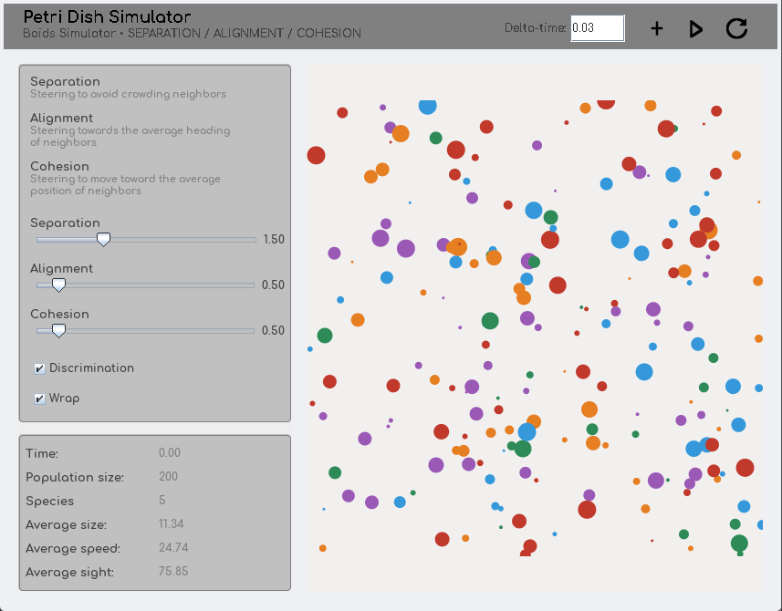

# petriDishSimulator

This project is a Java application packaged and distributed as a Docker image. It consists of a Boids-based simulator of flocking creatures, inspired by organisms found in a Petri dish.

**Docker Image** : `shimm0/petridishsimulator`

**Model repository** : [petriDishSimulatorMODEL](https://github.com/ShImM0/petriDishSimulatorMODEL)



## Table of Contents

- [Project Structure](#project-structure)
- [Model](#model)
- [Extension](#extension)
- [Dockerization](#dockerization)
- [Installation](#installation)
    - [Windows/WSL](#windowwsl)
    - [Linux](#linux)

## Project Structure

```text
.
├── Dockerfile      # To deploy on Docker
├── LICENSE
├── README.md
├── bin
│   ├── icons
│   └── simulator
├── pom.xml         # To package using Maven inside the container
├── resources       # Project resources
│   └── icons
└── src             # Main project code
    └── simulator
```


## Model

The simulation model is maintained in a separate repository: [petriDishSimulatorMODEL](https://github.com/ShImM0/petriDishSimulatorMODEL)

This repository cointains the design model used by this project, separating model from code.

## Extension
- [ ] Add an organism selection feature, allowing the user to click on an specific organism and displaying atributes such as speed, genetic code or id.
- [ ] Add Builder-based factories to build species, specifying certain attributes for organisms, such as halo width or speed limits.

## Dockerization

This is the process I used to dockerize this Java GUI application with a `pom.xml`.

1. Clone the project.

2. Write the Dockerfile, using the Maven base image and Java 21
    
    ```Dockerfile
    FROM maven:3.6.3-openjdk-17
    RUN microdnf install -y \
        libXext \
        libXrender \
        libXtst \
        libXi \
        libX11 \
        libxcb \
    && microdnf clean all
    WORKDIR /apps
    COPY . /apps
    CMD tail -f /dev/null
    ```

3. Build the image:

    ```bash
    docker build -t petridishsimulator .
    ```

4. Run the Docker Image:

    ```bash
    docker run --rm petridishsimulator
    ```

5. Check Maven dependencies and errors:

    ```bash
    mvn clean test
    mvn clean install
    ```

6. Update the Dockerfile to add the mvn commands.
    ```Dockerfile
    RUN mvn clean test
    RUN mvn clean install
    ```

7. Rebuild the image and run:

    ```bash
    docker build -t petridishsimulator .
    docker run --rm  petridishsimulator
    ```

8. Run the Main class and add it as `CMD` in the Dockerfile

    ```bash
    mvn exec:java -Dexec.mainClass="simulator.launcher.Main"
    ```
    ```Dockerfile
    CMD ["mvn", "exec:java", "-Dexec.mainClass=simulator.launcher.Main"]
    ```

9. Rebuild and run (using the next section if needed).

    ```bash
    docker run --rm \
        -v /tmp/.X11-unix:/tmp/.X11-unix \
        -e DISPLAY=$DISPLAY \
        shimm0/petridishsimulator
    ```

10. Push to DockerHub.

    ```bash
    docker tag petridishsimulator shimm0/petridishsimulator
    docker push shimm0/petridishsimulator
    ```


## Installation

### Windows/WSL

1. Install VcXsrv from this [link](https://vcxsrv.com/) using the step-by-step installation instructions provided (GitHub-> download from Releases).

2. Install WSL in Powershell and check that the version is 2.

    ```bash
    wsl --install
    wsl.exe -l -v
    ```

    If the version is 1, change it to WSL 2:

    ```bash
    wsl --set-version Ubuntu 2
    ```

3. Install Docker in WSL.

    ```bash
    sudo apt update
    sudo apt install snapd
    sudo snap install docker
    docker --version
    docker run hello-world
    ```

4. Launch XLaunch on Windows, selecting the options **Multiple windows** with display number `0`, **Start no client** and **Disable access control**.

5. Retrieve the Window host's IP address within WSL and configure `$DISPLAY`.

    ```bash
    export DISPLAY=$(ip route | awk '/default/ {print $3}'):0.0
    echo $DISPLAY
    ```

6. Check if the X server is working (a pop-up window should appear).

    ```bash
    sudo apt install x11-apps
    xclock
    ```

7. Run the Docker container.

    ```bash
    docker run -it --rm \
        --network=host \
        -e DISPLAY="$DISPLAY" \
        shimm0/petridishsimulator
    ```

    The simulator window should appear on the desktop.

### Linux

1. Install docker using the according package manager or this [link](https://docs.docker.com/engine/install).

    For Arch Linux:

    ```bash
    sudo pacman -S docker
    ```

    For Ubuntu/Debian, follow the official docker installation instructions.

    Verify installation:

    ```bash
    docker --version
    docker run hello-world
    ```

2. Check the Docker context, setting the default if necessary.

    ```bash
    docker context show
    docker context use default
    ```

3. Install xhost to add host names allowed to connect to the X server (already present in WSL).

    For Arch Linux:

    ```bash
    sudo pacman -s xorg-xhost
    ```

    For Ubuntu/Debian:

    ```bash
    sudo apt install x11-xserver-utils
    ```

    Verify installation:

    ```bash
    xhost
    ```

4. Allow Docker to connect to the X server.

    ```bash
    xhost +local:docker
    ```

5. Run the Docker container.

    ```bash
    docker run --rm \
        -v /tmp/.X11-unix:/tmp/.X11-unix \
        -e DISPLAY=$DISPLAY \
        shimm0/petridishsimulator
    ```

    The simulator window should appear on the desktop.


